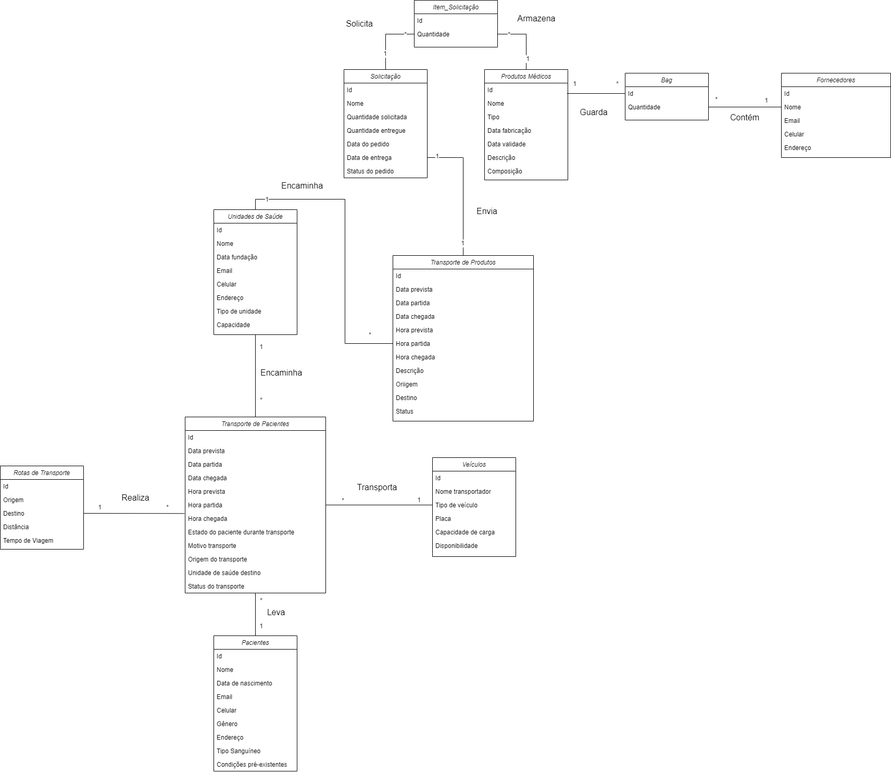

# Ponderada-Hospitalar

## Autora: 

<a href="https://www.linkedin.com/in/anna-aragao/"> Anna Aragão </a>


## Sumário

- [Ponderada-Hospitalar](#ponderada-hospitalar)
  - [Autora:](#autora)
  - [Sumário](#sumário)
  - [1. Introdução](#1-introdução)
  - [2. Modelo Lógico](#2-modelo-lógico)
  - [3. Deploy AWS](#3-deploy-aws)

## 1. Introdução

&emsp;&emsp;Imaginemos um cenário em que você é um consultor de banco de dados encarregado de desenvolver um modelo de entidade e relacionamento (basta o modelo lógico) para uma organização que busca aprimorar a prestação de serviços de transporte relacionados à saúde e à entrega de produtos médicos. Este desafio envolve a interligação crítica entre transporte e serviços/produtos médicos. Existe a necessidade de gerenciar eficazmente o transporte de pacientes para unidades de saúde, como hospitais, clínicas e centros de atendimento médico, enquanto simultaneamente garantindo a entrega eficiente de produtos médicos, como medicamentos, equipamentos médicos e suprimentos hospitalares. O sistema que vai usar este banco de dados deve permitir o acompanhamento de pacientes, garantindo que eles recebam tratamento médico oportuno e, ao mesmo tempo, gerenciar a logística de entrega de suprimentos médicos essenciais para essas instalações de saúde. Podemos ainda pensar nos fatores extras como a otimização de rotas de transporte de pacientes, gestão de frota de veículos médicos, controle de estoque de produtos médicos e a necessidade de avaliar continuamente a eficácia do sistema para melhorar o acesso a serviços de saúde e produtos médicos. Os dados gerados por esse sistema são vitais para a tomada de decisões estratégicas destinadas a aprimorar a prestação de serviços de saúde, garantindo que os pacientes recebam atendimento de qualidade e que os produtos médicos estejam disponíveis quando necessário.

## 2. Modelo Lógico

&emsp;&emsp;Um modelo lógico é uma representação visual ou descritiva de como um sistema, processo ou serviço funciona em termos lógicos, ou seja, como as partes se relacionam e interagem para atingir um objetivo específico. Ele descreve as etapas, os componentes, as interações e os resultados esperados de um sistema de forma clara e organizada.

&emsp;&emsp;Para uma organização que busca aprimorar a prestação de serviços de transporte relacionados à saúde e à entrega de produtos médicos, um modelo lógico pode ser extremamente útil pela visualização do processo, identificação de gargalos e ineficiências, compreensão das interações entre os componentes e a avaliação de impacto de mudanças.

<h6 align="center"> Figura 1: Modelo Lógico </h6>

<div style="text-align: center;">
  
</div>

&emsp;&emsp; Essas tabelas estão relacionadas de maneira que representam diferentes aspectos e entidades envolvidas no processo de transporte relacionado à saúde e à entrega de produtos médicos.

**Unidades_de_saude**

Esta tabela representa as unidades de saúde, como hospitais, clínicas, etc.

Atributos: id (chave primária), nome, data_fundacao, email, celular, endereco, tipo_unidade e capacidade.

**Solicitacao**

Esta tabela armazena as solicitações de produtos médicos feitas pelas unidades de saúde.

Atributos: id (chave primária), nome, quantidade_solicitada, quantidade_entregue, data_pedido, data_entrega e status_pedido.

**Produtos_Medicos**

Esta tabela contém informações sobre os produtos médicos disponíveis.

Atributos: id (chave primária), nome, tipo, data_fabricacao, data_validade, descricao e composicao.

**Fornecedores**

Armazena informações sobre os fornecedores de produtos médicos.

Atributos: id (chave primária), nome, email, celular e endereco.

**Veículos**

Representa os veículos utilizados para transporte de produtos médicos ou pacientes.

Atributos: id (chave primária), nome_transportador, tipo_veiculo, placa, capacidade_carga e disponibilidade.

**Pacientes**

Contém informações sobre os pacientes que podem necessitar de transporte para unidades de saúde.

Atributos: id (chave primária), nome, data_nascimento, email, celular, genero, endereco, tipo_sanguineo e condicoes_preexistentes.

**Rotas_Transporte**

Esta tabela descreve as rotas de transporte entre diferentes localidades.

Atributos: id (chave primária), origem, destino, distancia e tempo_viagem.

**Transporte_Produtos**

Registra o transporte de produtos médicos entre origem e destino.

Atributos: id (chave primária), data_prevista, data_partida, data_chegada, hora_prevista, hora_partida, hora_chegada, descricao, origem, destino, status, id_unidade_saude (chave estrangeira), id_solicitacao (chave estrangeira).

**Item_Solucao:**

Mantém informações sobre os itens necessários para satisfazer uma solicitação de produto médico.

Atributos: id (chave primária), quantidade, id_solicitacao (chave estrangeira), id_produto_medico (chave estrangeira).

**Bag**

Registra os itens fornecidos pelos fornecedores.

Atributos: id (chave primária), quantidade, id_fornecedor (chave estrangeira), id_produto_medico (chave estrangeira).

**Transporte_Pacientes**

Registra o transporte de pacientes entre diferentes localidades, como entre unidades de saúde.

Atributos: id (chave primária), data_prevista, data_partida, data_chegada, hora_prevista, hora_partida, hora_chegada, estado_paciente, motivo_transporte, origem_transporte, unidade_saude_destino, status_transporte, id_rota_transporte (chave estrangeira), id_veiculo (chave estrangeira), id_paciente (chave estrangeira), id_unidade_saude_destino (chave estrangeira).

## 3. Deploy AWS

&emsp;&emsp;Primeiro, foi realizada a etapa de criação de um banco de dados RDS (Relational Database Service) na AWS. Clica-se no botão "Create database" (ou "Criar banco de dados") para começar a configurar um novo banco de dados. O tipo de motor de banco de dados utilizado foi o MySQL, assim como pedido na introdução. 

&emsp;&emsp;Foram configurados:
1. Tipo de Uso Gratuito
2. Versão do banco de dados
3. Capacidade de computação e armazenamento
4. Nome de usuário e senha para acesso ao banco de dados 
5. Opções de backup e manutenção. 

<h6 align="center"> Figura 2: Banco de dados RDS </h6>

<div style="text-align: center;">
  
</div>

&emsp;&emsp;Após a criação, quando o banco de dados estiver disponível para uso, conectou-se o banco ao Dbeaver usando as informações de conexão fornecidas na console do RDS, como o endpoint, o nome do banco de dados, o nome de usuário e a senha.

<h6 align="center"> Figura 3: Informações para conexão </h6>

<div style="text-align: center;">
  
</div>

&emsp;&emsp;Configurou-se as tabelas e os dados testes no DBeaver para utilizar o banco de dados e realizar a consulta de Calcular o número médio de pacientes transportados por veículo por mês. 

<h6 align="center"> Figura 4: Configuração das tabelas com os dados para teste </h6>

<div style="text-align: center;">
  
</div>

<h6 align="center"> Figura 5: Diagrama DBeaver </h6>

<div style="text-align: center;">
  
</div>

&emsp;&emsp;Com todos os dados inseridos e trabalhados conforme a necessidade de cada tabela, segue o resultado após a execução da construção da consulta em SQL "Calcule o número médio de pacientes transportados por veículo por mês":

<h6 align="center"> Figura 6: Consulta em SQL </h6>

<div style="text-align: center;">
  
</div>

```SQL
SELECT
    Veiculos.id AS id_veiculo,
    Veiculos.nome_transportador AS nome_veiculo,
    COUNT(DISTINCT Transporte_Pacientes.id_paciente) AS total_pacientes_transportados,
    COUNT(DISTINCT Transporte_Pacientes.id_paciente) /
        (YEAR(MAX(Transporte_Pacientes.data_prevista)) * 12 + MONTH(MAX(Transporte_Pacientes.data_prevista)) -
        YEAR(MIN(Transporte_Pacientes.data_prevista)) * 12 + MONTH(MIN(Transporte_Pacientes.data_prevista))) AS media_pacientes_por_mes
FROM
    Transporte_Pacientes
INNER JOIN
    Veiculos ON Transporte_Pacientes.id_veiculo = Veiculos.id
GROUP BY
    Veiculos.id;
```

